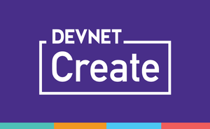

# Code for DevNet Create 2019 Automated BGP with IOx and Guestshell

"Automated BGP with IOx and Guestshell" - Written for DevNet Create 2019 (April 24-25) - Computer History Museum, Mountain View, CA

# Agenda

- Learning services and getting context
- Find the largest sources of stress
- IOS XE Guest Shell Configuration
- Device Management with: Embedded Event Manager / Python CLI /RESTCONF
- Execute Python scripts to detect any BGP changes
- Tie this to event-driven telemetry
